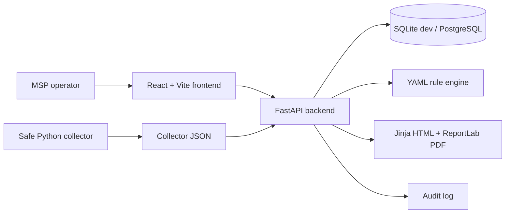
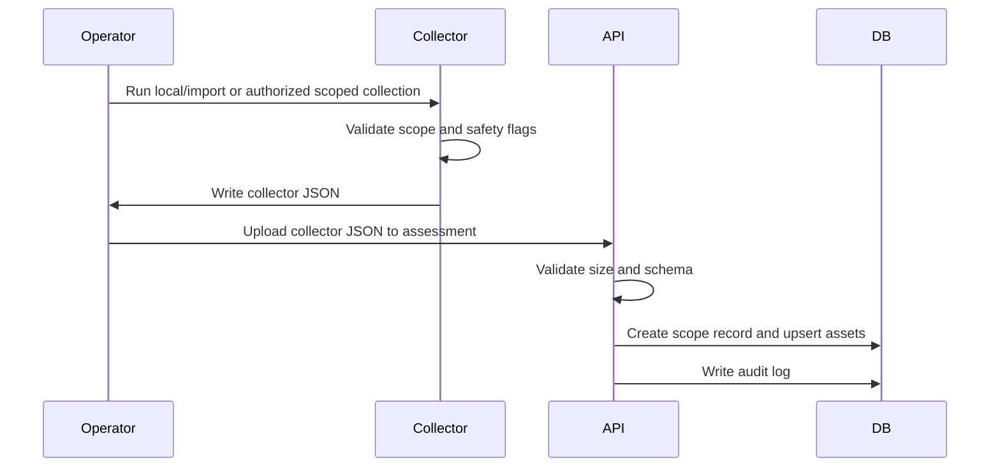
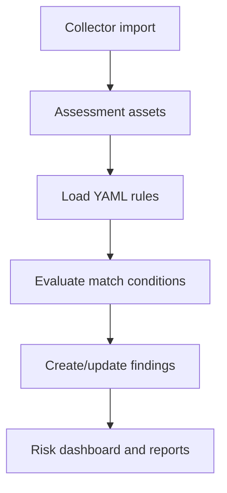
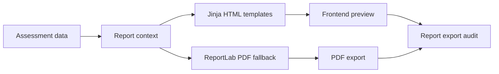

# Architecture

## Data Model Overview

Core entities:

- Client, Site, Contact, Note.
- Assessment and ScopeRecord.
- Asset with ownership, platform, last-seen, criticality, tags, and metadata.
- Finding with severity, category, evidence, impact, recommended remediation, status, source, confidence, and affected assets.
- AuditLog for login, imports, assessment creation, scope changes, report export, and finding status changes.

## Collector / Import Flow

## Rule Engine Flow

Rules live in `backend/app/rules/starter_rules.yml`. New rules can be added without changing Python code when they use supported operators such as `equals`, `contains`, `contains_any`, `in`, `not_in`, `missing`, `older_than_days`, `gte`, and `lt`.

## Report Generation Flow

